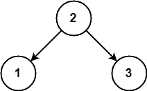

# Trees & Graphs

#### 4.1 - Route Between Nodes

Given a directed graph, design an algorithm to find out whether there is a route between two nodes.

#### 4.2 - Minimal Tree

Given a sorted (increasing order) array with unique integer elements, write an algorithm to create a binary search tree with minimal height.

#### 4.3 - List of Depths

Given a binary tree, design an algorithm which creates a linked list of all the nodes at each depth (e.g., if you have a tree with depth _D_, you'll have _D_ linked lists).

#### 4.4 - Check Balanced

Implement a function to check if a binary tree is balanced. For the purposes of this question, a balanced tree is defined to be a tree such that the heights of the two subtrees of any node never differ by more than one.

#### 4.5 - Validate BST

Implement a function to check if a binary tree is a binary search tree.

#### 4.6 - Successor

Write an algorithm to find the "next" node (i.e., in-order successor) of a given node in a binary search tree. You may assume that each node has a link to its parent.

#### 4.7 - Build Order

You are given a list of projects and a list of dependencies (which is a list of pairs of projects, where the second project is dependent on the first project). All of a project's dependencies must be built before the project is. Find a build order that will allow the projects to be built. If there is no valid build order, return an error.

_EXAMPLE_

Input:

&nbsp;&nbsp;&nbsp;&nbsp;_projects_: a, b, c, d, e, f

&nbsp;&nbsp;&nbsp;&nbsp;_dependencies_: (a, d), (f, b), (b, d), (f, a), (d, c)

Output: f, e, a, b, d, c

#### 4.8 - First Common Ancestor

Design an algorithm and write code to find the first common ancestor of two nodes in a binary tree. Avoid storing additional nodes in a data structure.

_NOTE_: This is not necessarily a binary search tree.

#### 4.9 - BST Sequences

A binary search tree was created by traversing through an array from left to right and inserting each element. Given a binary search tree with distinct elements, print all possible arrays that could have led to this tree.

_EXAMPLE_

Input:

Output: {2, 1, 3}, {2, 3, 1}

#### 4.10 - Check Subtree

_T1_ and _T2_ are two very large binary trees, with _T1_ much bigger than _T2_. Create an algorithm to determine if _T2_ is a subtree of _T1_. A tree _T2_ is a subtree of _T1_ if there exists a node _n_ in _T1_ such that the subtree of _n_ is identical to _T2_. That is, if you cut off the tree at node _n_, the two trees would be identical.

#### 4.11 - Random Node

You are implementing a binary tree class from scratch which, in addition to _insert_, _find_, and _delete_, has a method _getRandomNode()_ which returns a random node from the tree. All nodes should be equally likely to be chosen. Design and implement an algorithm for _getRandomNode_, and explain how you would implement the rest of the methods.

#### 4.12 - Paths with Sum

You are given a binary tree in which each node contains an integer value (which might be positive or negative). Design an algorithm to count the number of paths that sum to a given value. The path does not need to start or end at the root or a leaf, but it must go downwards (traveling only from parent nodes to child nodes).