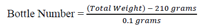

In order to solve the problem by using the scale only once, we need to weigh pills from all the different bottles at once. How can we do this such that we can figure out which of the bottles contain the heavier pills? We can do this by weighing a unique number of pills from each of the bottles together, which will give us an indication of which bottle contains the heavy pills.

First, order the bottles from 1 to 20. Now, for each bottle, we will add that number of pills to the scale given its order in line (e.g. we add 3 pills from bottle #3, 5 pills from bottle #5, etc). By the end, we will have 1 + 2 + 3 + … + 19 + 20, or 210 pills on the scale (using the summation formula). Assuming that each pill weighs 1.0 grams, this means that the scale should read 210.0 grams.

However, since we’ve added x pills from bottle #x, this means that the final weight will indicate which bottle contains the heavier pills. For example, say bottle #15 contains the heavier pills; the final weight should be 211.5 (this is because we put 15 1.1g pills on the scale, adding an extra 1.5 grams than it should be). Therefore, we can find the bottle containing the heavier pills with the given formula:

