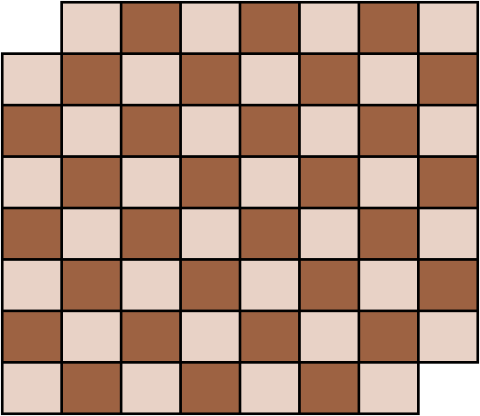

We can visualize a chessboard with 2 of its diagonal corners cut as the following:

Notice that when we lay out a domino onto the board, the domino must occupy 2 adjacent squares (one dark and one light). You may have noticed that the two diagonal opposite squares are the same color. After we cut off two diagonally opposite ends, we are now left with 30 tiles of one color, and 32 of another.

If we want to cover the board with 31 dominos, each domino must occupy two tiles, one of each color. This means that we can use 30 of the dominos to cover the board, and be left with 2 tiles of the same color. However, the final domino cannot cover the two final tiles since they are the same color, and no two similar tiles on a chessboard are adjacent to one another (excluding diagonally). Therefore, covering this chessboard with 31 dominos is impossible.
