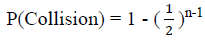

If we imagine ants on a triangle moving in a direction, we can see that no ants will collide if they all are moving in the same direction. If we find this probability, we can easily figure out the probability of collision.

Each ant can move in 2 directions, and each ant must choose the same direction in order for there to be no collision. Also, do not forget that all ants can either move clockwise or counter-clockwise for there to be no collisions. Therefore, we get the following probabilities:

This means that there is a 25% chance of no collision when the ants start walking. Therefore, there is a 75% chance of one or more of the ants colliding.

The same logic applies if we want to find the probability of collision on an n-vertex polygon. Of course, now the ants can all move in 2n possible ways. Therefore, the probability of no collision is:

Therefore, the probability of collision on an n-vertex polygon is:

