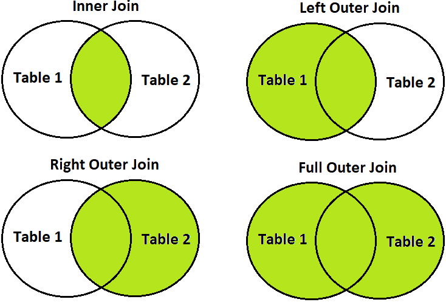

There are 4 main types of joins outlined below:

#### Inner Join

An inner join only returns records from both joined tables that meeting

#### Left Join

FIXME

#### Right Join

FIXME

#### Full Outer Join

FIXME