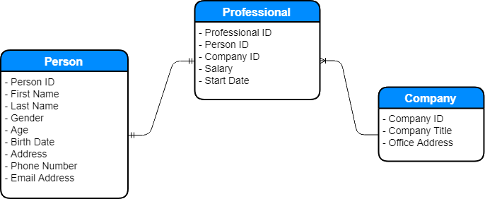

Below is an example of how an ERD with people, employee professionals, and companies might look like:

Each company has multiple professionals, and each professional (presumably) works at only one company, making the professional-company relationship many-to-one. Each person in the database is also a professional, making the person-professional relationship one-to-one. You can define as many columns in each table as you want (so long as they make sense with the table), as long as they are linked up properly. In this example, each professional is linked to a person entity by the person's *Person ID*, and also linked to a company by the company's *Company ID*.
