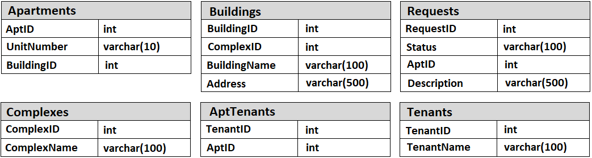

# Databases

Questions 1 through 3 refer to the database schema shown below. Each apartment can have multiple tenants, and each tenant can have multiple apartments. Each apartment belongs to one building, and each building belongs to one complex.

#### 14.1 - Multiple Apartments

Write a SQL query to get a list of tenants who are renting more than one apartment.

#### 14.2 - Open Requests

Write a SQL query to get a list of all buildings and the number of open requests (Requests in which status equals 'Open').

#### 14.3 - Close All Requests

Building #11 is undergoing a major renovation. Implement a query to close all requests from apartments in this building.

#### 14.4 - Joins

What are the different types of joins? Please explain how they differ and why certain types are better in certain situations.

#### 14.5 - Denormalization

What is denormalization? Explain the pros and cons.

#### 14.6 - Entity-Relationship Diagram

Draw an entity-relationship diagram for a database with companies, people, and professionals (people who work for companies).

#### 14.7 - Design Grade Database

Imagine a simple database storing information for students' grades. Design what this database might look like and provide a SQL query to return a list of the honor roll students (top 10%), sorted by their grade point average.

