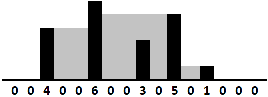

# Hard Exercises

#### 17.1 - Add Without Plus

Write a function that adds two numbers. You should not use+ or any arithmetic operators.

#### 17.2 - Shuffle

Write a method to shuffle a deck of cards. It must be a perfect shuffle; in other words, each of the 52! permutations of the deck has to be equally likely. Assume that you are given a random number generator which is perfect.

#### 17.3 - Random Set

Write a method to randomly generate a set of _m_ integers from an array of size _n_. Each element must have equal probability of being chosen.

#### 17.4 - Missing Number

An array _A_ contains all the integers from 0 to _n_, except for one number which is missing. In this problem, we cannot access an entire integer in _A_ with a single operation. The elements of _A_ are represented in binary, and the only operation we can use to access them is "fetch the j<sup>th</sup> bit of _A[i]_", which takes constant time. Write code to find the missing integer. Can you do it in O(n) time?

#### 17.5 - Letters and Numbers

Given an array filled with letters and numbers, find the longest subarray with an equal number of letters and numbers.

#### 17.6 - Count of 2s

Write a method to count the number of 2s that appear in all the numbers between 0 and _n_ (inclusive).

_EXAMPLE_

Input: 25

Output: 9 (2, 12, 20, 21, 22, 23, 24 and 25. Note that 22 counts for two 2s.)

#### 17.7 - Baby Names

Each year, the government releases a list of the 10000 most common baby names and their frequencies (the number of babies with that name). The only problem with this is that some names have multiple spellings. For example, "John" and ''Jon" are essentially the same name but would be listed separately in the list. Given two lists, one of names/frequencies and the other of pairs of equivalent names, write an algorithm to print a new list of the true frequency of each name. Note that if John and Jon are synonyms, and Jon and Johnny are synonyms, then John and Johnny are synonyms. (It is both transitive and symmetric.) In the final list, any name can be used as the "real" name.

_EXAMPLE_

Input:

&nbsp;&nbsp;&nbsp;&nbsp;Names: John (15), Jon (12), Chris (13), Kris (4), Christopher (19)

&nbsp;&nbsp;&nbsp;&nbsp;Synonyms: (Jon, John), (John, Johnny), (Chris, Kris), (Chris, Christopher)

Output: John (27), Kris (36)

#### 17.8 - Circus Tower

A circus is designing a tower routine consisting of people standing atop one another's shoulders. For practical and aesthetic reasons, each person must be both shorter and lighter than the person below him or her. Given the heights and weights of each person in the circus, write a method to compute the largest possible number of people in such a tower.

_EXAMPLE_

Input (ht,wt): (65, 100) (70, 150) (56, 90) (75, 190) (60, 95) (68, 110)

Output: The longest tower is length 6 and includes from top to bottom:

(56, 90) (60,95) (65,100) (68,110) (70,150) (75,190)

#### 17.9 - K<sup>th</sup> Multiple

Design an algorithm to find the k<sup>th</sup> number such that the only prime factors are 3, 5, and 7. Note that 3, 5, and 7 do not have to be factors, but it should not have any other prime factors. For example, the first several multiples would be (in order) 1, 3, 5, 7, 9, 15, 21.

#### 17.10 - Majority Element

A majority element is an element that makes up more than half of the items in an array. Given a positive integers array, find the majority element. If there is no majority element, return -1. Do this in O(N) time and O(1) space.

_EXAMPLE_

Input: 1 2 5 9 5 9 5 5 5

Output: 5

#### 17.11 - Word Distance

You have a large text file containing words. Given any two words, find the shortest distance (in terms of number of words) between them in the file. If the operation will be repeated many times for the same file (but different pairs of words), can you optimize your solution?

#### 17.12 - BiNode

Consider a simple data structure called _BiNode_, which has pointers to two other nodes.

```java
public class BiNode {
    public BiNode nodel, node2;
    public int data;
}
```

The data structure _BiNode_ could be used to represent both a binary tree (where _node1_ is the left node and _node2_ is the right node) or a doubly linked list (where _node1_ is the previous node and _node2_ is the next node). Implement a method to convert a binary search tree (implemented with _BiNode_) into a doubly linked list. The values should be kept in order and the operation should be performed in place (that is, on the original data structure).

#### 17.13 - Re-Space

Oh, no! You have accidentally removed all spaces, punctuation, and capitalization in a lengthy document. A sentence like "I reset the computer. It still didn't boot!" became "iresetthecomputeritstilldidntboot''. You'll deal with the punctuation and capitalization later; right now you need to re-insert the spaces. Most of the words are in a dictionary but a few are not. Given a dictionary (a list of strings) and the document (a string), design an algorithm to unconcatenate the document in a way that minimizes the number of unrecognized characters.

_EXAMPLE_

Input: jesslookedjustliketimherbrother

Output: <u>jess</u> looked just like <u>tim</u> her brother (7 unrecognized characters)

#### 17.14 - Smallest K

Design an algorithm to find the smallest _K_ numbers in an array.

#### 17.15 - Longest Word

Given a list of words, write a program to find the longest word made of other words in the list.

_EXAMPLE_

Input: cat, banana, dog, nana, walk, walker, dogwalker

Output: dogwalker

#### 17.16 - The Masseuse

A popular masseuse receives a sequence of back-to-back appointment requests and is debating which ones to accept. She needs a 15-minute break between appointments and therefore she cannot accept any adjacent requests. Given a sequence of back-to-back appointment requests (all multiples of 15 minutes, none overlap, and none can be moved), find the optimal (highest total booked minutes) set the masseuse can honor. Return the number of minutes.

_EXAMPLE_

Input: {30, 15, 60, 75, 45, 15, 15, 45}

Output:180 minutes ({30, 60, 45, 45}).

#### 17.17 - Multi Search

Given a string band an array of smaller strings _T_, design a method to search _b_ for each small string in _T_.

#### 17.18 - Shortest Supersequence

You are given two arrays, one shorter (with all distinct elements) and one longer. Find the shortest subarray in the longer array that contains all the elements in the shorter array. The items can appear in any order.

_EXAMPLE_

Input: {1, 5, 9} | {7, 5, 9, 0, 2, 1, 3, <u>5, 7, 9, 1</u>, 1, 5, 8, 8, 9, 7}

Output: [7, 10] (the underlined portion above)

#### 17.19 - Missing Two

You are given an array with all the numbers from 1 to _N_ appearing exactly once, except for one number that is missing. How can you find the missing number in O(N) time and O(1) space? What if there were two numbers missing?

#### 17.20 - Continuous Median

Numbers are randomly generated and passed to a method. Write a program to find and maintain the median value as new values are generated.

#### 17.21 - Volume of Histogram

Imagine a histogram (bar graph). Design an algorithm to compute the volume of water it could hold if someone poured water across the top. You can assume that each histogram bar has width 1.

_EXAMPLE_ (Black bars are the histogram. Gray is water.)

<p align="center"></p>
Output: 26

#### 17.22 - Word Transformer

Given two words of equal length that are in a dictionary, write a method to transform one word into another word by changing only one letter at a time. The new word you get in each step must be in the dictionary.

_EXAMPLE_

Input: DAMP, LIKE

Output: DAMP -> LAMP -> LIMP -> LIME -> LIKE

#### 17.23 - Max Black Square

Imagine you have a square matrix, where each cell (pixel) is either black or white Design an algorithm to find the maximum subsquare such that all four borders are filled with black pixels.

#### 17.24 - Max Submatrix

Given an _NxN_ matrix of positive and negative integers, write code to find the submatrix with the largest possible sum.

#### 17.25 - Word Rectangle

Given a list of millions of words, design an algorithm to create the largest possible rectangle of letters such that every row forms a word (reading left to right) and every column forms a word (reading top to bottom). The words need not be chosen consecutively from the list but all rows must be the same length and all columns must be the same height.

#### 17.26 - Sparse Similarity

The similarity of two documents (each with distinct words) is defined to be the size of the intersection divided by the size of the union. For example, if the documents consist of integers, the similarity of { 1, 5, 3 } and { 1, 7, 2, 3 } is 0.4, because the intersection has size 2 and the union has size 5.

We have a long list of documents (with distinct values and each with an associated ID) where the similarity is believed to be "sparse". That is, any two arbitrarily selected documents are very likely to have similarity 0. Design an algorithm that returns a list of pairs of document IDs and the associated
similarity.

Print only the pairs with similarity greater than 0. Empty documents should not be printed at all. For simplicity, you may assume each document is represented as an array of distinct integers.

_EXAMPLE_

Input:

&nbsp;&nbsp;&nbsp;&nbsp;13: {14, 15, 100, 9, 3}

&nbsp;&nbsp;&nbsp;&nbsp;16: {32, 1, 9, 3, 5}

&nbsp;&nbsp;&nbsp;&nbsp;19: {15, 29, 2, 6, 8, 7}

&nbsp;&nbsp;&nbsp;&nbsp;24: {7, 10}

Output:

ID1, ID2, SIMILARITY

13, 19, 0.1

13, 16, 0.25

19, 24, 0.14285714285714285